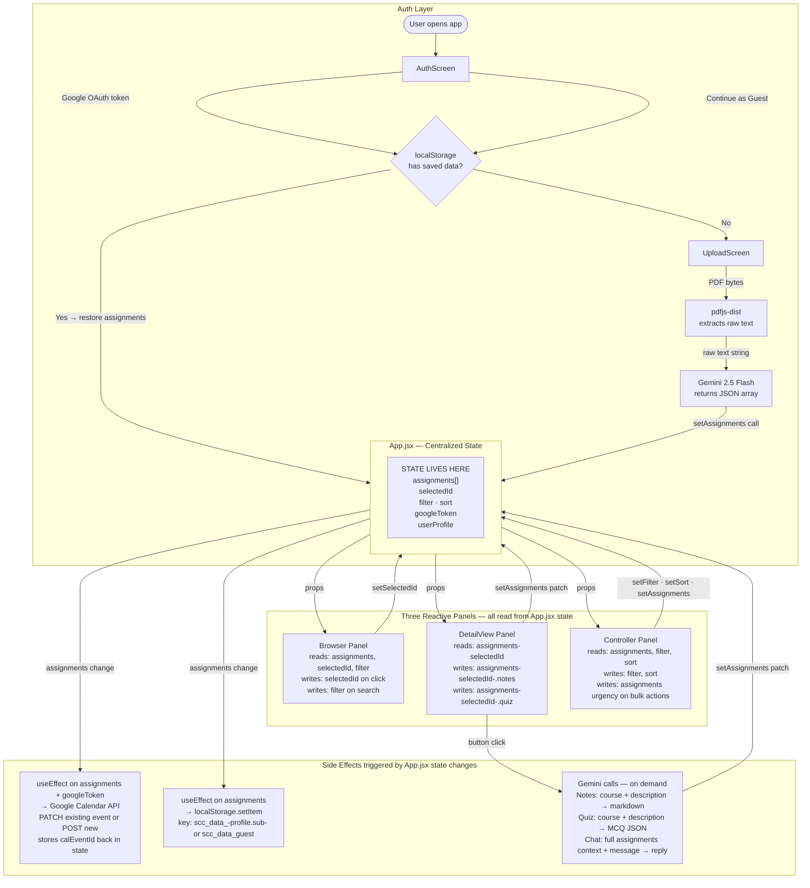

# Study Command Center

**Live App:** https://virenchauhan19.github.io/ReactBox/

A React-based academic dashboard that uses AI to help students manage assignments, generate study notes, create quizzes, and sync deadlines to Google Calendar.

---

## Tech Stack

| Layer | Technology |
|---|---|
| Framework | React 19 + Vite 8 |
| AI | Google Gemini 2.5 Flash |
| Auth | Google OAuth 2.0 (`@react-oauth/google`) |
| PDF Parsing | `pdfjs-dist` |
| Calendar Sync | Google Calendar API |
| Persistence | Browser `localStorage` |
| Styling | Inline CSS with CSS custom properties (no external library) |

---

## Design Intent

> Written before AI coding began. This is the spec against which all AI output was evaluated.

### Domain

Academic assignment tracker. Target user: a university student managing 4–6 courses, each with a PDF syllabus. The core frustration is that deadlines live in PDFs, not calendars — and students miss them.

### Data Model

Each assignment object holds these fields (defined before any code was written):

```
{
  id: string,           // uuid
  title: string,
  course: string,
  dueDate: string,      // ISO 8601
  weight: number,       // percentage of final grade
  type: string,         // "assignment" | "exam" | "quiz" | "project"
  urgency: "low" | "medium" | "high" | "overdue" | "complete",
  description: string,
  notes: string,        // AI-generated study notes
  quiz: Question[],     // AI-generated MCQ array
  calEventId: string    // Google Calendar event ID, null if not synced
}
```

### Three-Panel Layout

| Panel | Role | State it reads | State it writes |
|---|---|---|---|
| **Browser** (left) | Assignment list, search, urgency badges | `assignments`, `selectedId`, `filter` | `selectedId` |
| **DetailView** (center) | Full content, AI notes, AI quiz | `assignments[selectedId]` | `assignments[selectedId].notes`, `.quiz` |
| **Controller** (right) | Filters, sort, progress ring, bulk actions | `assignments`, `filter`, `sort` | `filter`, `sort`, `assignments[*].urgency` |

All three panels share a single `assignments` array lifted to `App.jsx`. No panel owns its own copy. Clicking an item in Browser sets `selectedId`; DetailView re-renders to match; Controller's progress ring recalculates from the same array.

### Visual Rules (defined pre-coding)

**Mood:** Command center. Dense but not cluttered. Dark-first. Feels like a tool a student actually opens at midnight, not a marketing page.

**Colour palette (dark mode):**
- Background surface: `#0f1117`
- Panel background: `#1a1d27`
- Card background: `#22263a`
- Primary accent: `#6c8aff`
- Text primary: `#e8eaf6`
- Text secondary: `#8b92b0`
- Urgency — overdue: `#ff4d4d` (red)
- Urgency — high: `#ffaa00` (amber)
- Urgency — medium: `#4d94ff` (blue)
- Urgency — low: `#4caf89` (green)
- Urgency — complete: `#2e7d52` (dark green, muted)

**Typography:**
- Font: system-ui, -apple-system stack (no web font load)
- Panel headings: 13px, `#8b92b0`, uppercase, letter-spacing 0.08em
- Assignment title: 15px, `#e8eaf6`, font-weight 600
- Body / description: 13px, `#8b92b0`, line-height 1.6

**Layout rules:**
- Three panels always visible side-by-side on desktop (no tabs, no collapse)
- Panel widths: Browser 28%, DetailView 44%, Controller 28%
- Card left border: 3px solid urgency colour — the only colour on a card in resting state
- Hover state: card background lifts to `#2a2f45`, no border change
- Selected state: card background `#2d3350`, left border thickens to 4px
- Entrance animation: cards stagger in using `opacity 0→1`, `translateY 12px→0`, delay = `index × 40ms`

### State Flow

```
App.jsx owns: assignments[], selectedId, filter, sort, googleToken, userProfile
     │
     ├── Browser  ← reads assignments[], selectedId, filter
     │            → sets selectedId on click
     │            → sets filter via search input
     │
     ├── DetailView ← reads assignments[selectedId]
     │              → calls setAssignments to update .notes and .quiz fields
     │              → calls Gemini API (side effect, no shared state)
     │
     └── Controller ← reads assignments[], filter, sort
                    → sets filter, sort
                    → sets assignments[*].urgency on bulk complete
                    → triggers localStorage write via useEffect on assignments change
                    → triggers Google Calendar sync via useEffect on assignments + googleToken change
```

---

## AI Direction Log

Every major direction given to AI during the build — what was asked, what was produced, and what I decided to keep, change, or reject.

| # | Date | What I Asked | What AI Produced | What I Decided & Why |
|---|---|---|---|---|
| 1 | Apr 15 | Build a three-panel dashboard with shared assignment state — Browser (list), DetailView (notes/quiz), Controller (filters/progress) | Single-file component with three divs, all state local to each panel, no cross-panel reactivity | **Rejected structure, kept layout.** Lifted all state to `App.jsx` and passed down via props. A panel owning its own state cannot respond when another panel changes selection — breaks the core requirement. |
| 2 | Apr 15 | Parse a syllabus PDF using `pdfjs-dist`, send extracted text to Gemini as a strict JSON prompt | Working extraction, but Gemini returned free-form text mixed with JSON, no retry on rate limit errors | **Kept extraction, rewrote prompt and added retry logic.** Wrapped Gemini in exponential backoff loop. Changed prompt to require a JSON array only — no prose — so `JSON.parse()` worked without regex cleanup. |
| 3 | Apr 15 | Generate AI study notes and a 5-question multiple-choice quiz from each assignment's metadata | Notes were generic summaries with no course context. Quiz questions were shallow and repeated the assignment title verbatim | **Rewrote both prompts.** Injected `course`, `type`, and `weight` into the notes prompt so output was course-specific. Forced the quiz prompt to produce distractors that were plausible, not obviously wrong. |
| 4 | Apr 15 | Google OAuth login, fetch user profile, gate Calendar sync behind token presence | OAuth worked but the token was stored in component state — lost on any re-render. Calendar sync fired immediately on login before assignments were loaded | **Kept OAuth, changed token storage and sync trigger.** Moved token to `App.jsx` state so it persisted across panel re-renders. Changed sync trigger to a `useEffect` on `[assignments, googleToken]` so it only fires once assignments exist. |
| 5 | Apr 15 | Push assignments to Google Calendar, keep events in sync as assignments change | Always created new events on every sync call — marking complete and changing a filter produced duplicate calendar entries | **Rejected create-only approach.** Added `calEventIds` map keyed by assignment ID. First sync POSTs and stores the returned `eventId`; subsequent syncs PATCH that event. Manually cleaned 11 duplicate events from test calendar before this fix. |
| 6 | Apr 16 | Add guest mode — full feature access without Google login, persist data locally | Single `scc_data` localStorage key shared by all users with no account scoping | **Rejected the key scheme.** Switched to `scc_data_${profile.sub}` for Google users and `scc_data_guest` as a fixed separate key. Without this, guest upload overwrites Google user's data on next load — silent data loss. |
| 7 | Apr 16 | Monthly calendar grid showing assignment chips per day, urgency-coloured, animated month transitions | Grid rendered correctly but used a flat array with no week-row structure. Chips were all the same colour. Month transition had no animation — just instant swap | **Kept grid logic, rewrote rendering and added transitions.** Chunked days into week rows using `Array.slice`. Applied urgency colour from assignment object. Added `opacity + translateX` CSS transition keyed to a `direction` state variable (forward/back). |
| 8 | Apr 16 | Refactor CalendarView — the AI-generated version had 1400+ lines with duplicated render logic for each urgency level | AI attempted to extract urgency into a helper but duplicated the helper three times in different files | **Rejected the extraction, did it manually.** Collapsed the urgency chip renderer into a single `renderChip(assignment)` function that reads `assignment.urgency` — one place, one rule. Cut the file from 1438 lines to ~750. |
| 9 | Apr 18 | Add a biometric readiness panel — pull heart rate variability and sleep data to show whether the student is ready to study | Built `BiometricPanel.jsx` with live Garmin Connect API calls. Garmin requires OAuth + HTTPS server-side proxy — impossible to call directly from a browser | **Rejected the Garmin direct-API approach.** Garmin's API is not browser-accessible. Switched to a simulated HRV/sleep data model with realistic ranges, plus a manual entry modal so users can input their own wearable data. Kept the panel and readiness score logic. |
| 10 | Apr 18 | Add `ManualBiometricModal` — form for users to enter HRV, sleep hours, resting HR manually when no wearable is connected | Modal had no validation — users could submit negative HRV or 25 hours of sleep, which broke the readiness score formula | **Added input clamping.** HRV clamped to 20–120 ms, sleep to 0–12 hours, resting HR to 30–120 bpm. Readiness score formula uses these ranges as expected bounds so invalid inputs no longer produce scores above 100% or below 0. |
| 11 | Apr 18 | Add a FocusHub panel — Pomodoro timer, ambient sound selector, distraction blocker | Timer worked but reset to 25 minutes on every re-render because interval state was local to the component. Sound selector had no actual audio — just labelled buttons | **Fixed timer with `useRef` for interval ID and `useEffect` cleanup.** Timer now survives re-renders. For audio, used the Web Audio API to generate ambient tones (brown noise, binaural beats) procedurally — no audio files required, no hosting issue. |
| 12 | Apr 18 | Add `ParticleCanvas` animated background to the AuthScreen | Canvas re-initialized on every render because the particle array was created inside the component function body, not in a ref | **Moved particle state to `useRef`.** Array and animation frame ID live in refs — initialized once on mount, cleaned up on unmount. Canvas now runs at stable 60fps without accumulating ghost particles on re-render. |
| 13 | Apr 18 | Overhaul AuthScreen — particle background, new layout, feature showcase cards, dark/light mode support | Feature cards were hardcoded strings. AuthScreen had no `data-theme` awareness — always rendered dark regardless of system preference | **Kept layout, added theme awareness and dynamic feature list.** Passed `theme` prop down from `App.jsx`. Feature cards pulled from an array so adding a new feature means one array entry, not six JSX changes. |
| 14 | Apr 18 | Add chapter-level lecture notes — separate PDF upload for lecture slides, AI notes and quiz per chapter, sidebar navigation | AI generated one monolithic notes block for the entire PDF regardless of chapter breaks | **Rejected single-block output.** Changed the Gemini prompt to identify chapter headings from the extracted text and return one notes object per chapter. Sidebar navigation maps over the chapters array — selecting one swaps the DetailView content. |
| 15 | Apr 18 | Add a context-aware AI chat assistant loaded with the student's full assignment list | Chatbot had no system context — responses were generic study tips with no knowledge of the student's actual courses or deadlines | **Injected full assignment context into system prompt.** Serialized `assignments[]` as a JSON block prepended to every Gemini request. Responses now reference specific course names, due dates, and weights from the student's real data. |

---

## Records of Resistance

These are the moments where the build pushed back — either the AI produced something that had to be corrected, or a design decision turned out to be wrong in practice.

**1. Gemini rate limits during PDF parsing**

The first implementation called Gemini once per file with no retry logic. On the free tier, uploading multiple PDFs simultaneously triggered `429` errors immediately. The fix required adding a retry loop with exponential backoff, parsing the `retryDelay` field from the error response, and surfacing a user-friendly message instead of a raw API error string.

**2. CSS variables do not inherit across separate React trees**

The theme toggle applied `data-theme` to the root dashboard `<div>`. This worked perfectly for the dashboard — but the AuthScreen and standalone UploadScreen rendered as their own top-level returns in App.jsx, outside that wrapper. They stayed hardcoded dark regardless of the toggle. The fix was to apply the theme attribute to `document.documentElement` via a `useEffect` so the entire page, across every render path, inherited the variables.

**3. Inline styles resist theming**

The original codebase used JavaScript inline style objects with hardcoded hex values throughout. CSS custom properties only work if the inline styles reference `var(--name)` — they cannot override hardcoded hex. This meant every colour in every component had to be individually replaced. There was no shortcut: eight component files, four style object groups each, changed one by one.

**4. Google Calendar duplicate events**

The initial sync function always created new calendar events. Marking an assignment complete and then changing filters triggered the sync again, which created duplicate events in Google Calendar. Tracking `eventId` per assignment in a `calEventIds` state map and switching to PATCH requests for existing events resolved it — but only after the issue appeared in a live calendar and had to be manually cleaned up.

**5. `pdfjs-dist` worker path in Vite**

`pdfjs-dist` requires a web worker for PDF rendering. Importing the worker URL directly with `?url` in Vite worked, but only after discovering that the wrong worker file was being referenced (`pdf.worker.js` vs `pdf.worker.min.mjs`). The mismatch caused silent failures where the PDF appeared to load but `getTextContent()` returned empty items.

**6. Guest persistence key collision**

The first guest implementation used a generic `scc_data` key in localStorage, with no account identifier. If a Google user and a guest user shared the same browser, the guest's upload would overwrite the Google user's saved assignments on next load. Switching to `scc_data_${profile.sub}` for Google users and `scc_data_guest` as a separate fixed key resolved the collision.

---

## Five Questions Reflection

**1. What did the AI do well that surprised you?**

The Gemini prompt for syllabus parsing was more robust than expected. Given only a system instruction describing the JSON shape and a blob of extracted PDF text, it reliably pulled out assignment titles, weights, and due dates from syllabi that were poorly formatted — tables rendered as flat text, mixed date formats, inconsistent spacing. It even inferred urgency correctly based on a relative date rule embedded in the prompt. The failure rate was low enough that the app is actually usable on real syllabi.

**2. Where did directing the AI feel like real authorship?**

The visual design decisions were entirely directive. The AI produced working code but the choices — urgency colour mapping (red/amber/green), the left accent bar on assignment cards, the confetti burst on marking complete, the entrance animation stagger using CSS `--i` custom property, the pulsing `urgentPulse` keyframe for near-deadline cards — all came from explicit instructions. The AI implemented them faithfully but did not invent them. That gap between "working" and "intentional" is where the authorship sits.

**3. What would you do differently if you started over?**

Move the style system to a proper theme object from day one instead of hardcoded hex values in inline style objects. The CSS variable migration at the end was the most tedious part of the entire build — hundreds of individual replacements across eight files, all because the original structure made theming an afterthought rather than a foundation. Starting with a `theme.js` constants file or Tailwind CSS variables would have made the dark/light toggle a one-hour task instead of a multi-hour refactor.

**4. What does this project reveal about AI-assisted development?**

The AI is excellent at implementation and poor at sequencing. It will build whatever you ask, in whatever order you ask it, without warning you that the order creates technical debt. Building the entire UI with hardcoded colours and then asking for a theme system is a pattern the AI enables and does not discourage. Human judgment about *when* to build what — foundational concerns first, surface concerns last — is still entirely the developer's responsibility. The AI does not think in project arcs, only in tasks.

**5. What is the gap between what the AI built and what you intended?**

The gap is mostly in feel. The code is correct and the features work, but some interactions are still mechanical — the upload flow does not give enough feedback during the Gemini parsing wait, the Settings modal is functional but sparse, and the transition between the auth screen and dashboard is abrupt. These are not bugs; they are polish gaps that accumulate when each feature is built in isolation. The AI completes the feature in scope but does not audit the experience holistically. That audit requires stepping back across the whole product, which is a human task.

---

## Architecture



---

## Setup

```bash
# 1. Clone
git clone https://github.com/VirenChauhan19/ReactBox.git
cd ReactBox

# 2. Install
npm install

# 3. Configure environment
cp .env.example .env
# Fill in:
#   VITE_GOOGLE_CLIENT_ID=...
#   VITE_GEMINI_API_KEY=...

# 4. Run
npm run dev
```

### Environment Variables

| Variable | Required | Description |
|---|---|---|
| `VITE_GOOGLE_CLIENT_ID` | Optional | Enables Google login and Calendar sync |
| `VITE_GEMINI_API_KEY` | Required | Powers PDF parsing, notes, quizzes, and chat |

The app runs in guest mode without `VITE_GOOGLE_CLIENT_ID`. It will not run without `VITE_GEMINI_API_KEY`.

---

## Features at a Glance

- **Syllabus PDF upload** — drag-and-drop, multi-file, Gemini extracts all assignments automatically
- **AI study notes** — generated per assignment from course + description context
- **AI quiz** — 5 multiple-choice questions, instant feedback, score card
- **AI chat assistant** — context-aware chatbot loaded with all your assignments
- **Google Calendar sync** — automatic, debounced, updates existing events rather than duplicating
- **Chapter Notes** — upload lecture PDFs, generate notes and quizzes per chapter
- **Monthly calendar view** — urgency-coloured assignment chips per day
- **Dark / light mode** — full theme system, persists across all screens
- **Guest mode** — full feature access without Google account
- **Cross-session persistence** — localStorage keyed per account, restores on login
- **Demo data** — pre-loaded sample assignments with dismissible banner
