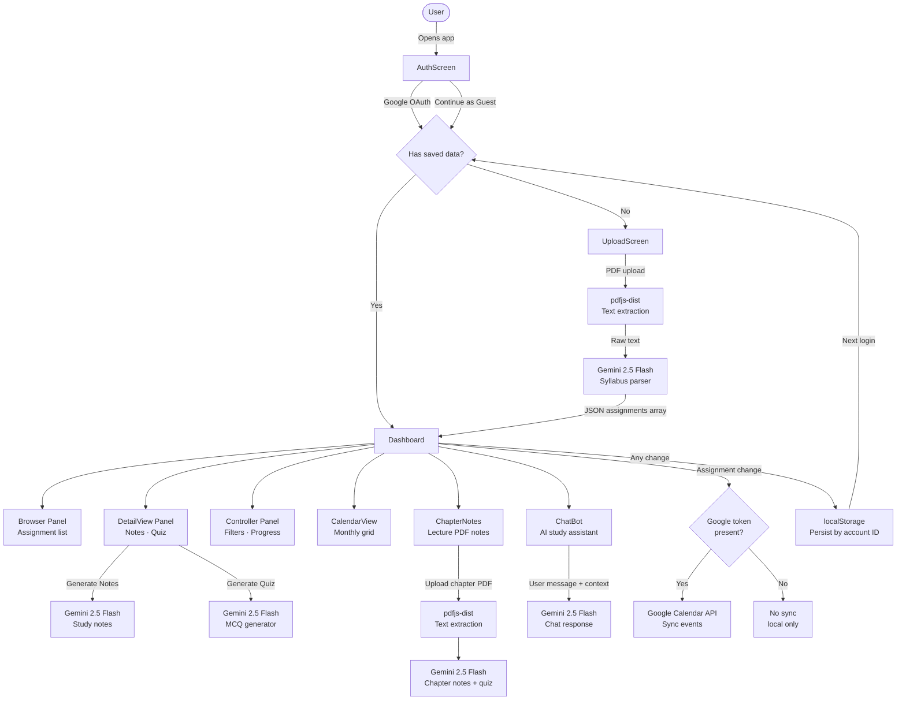

# Study Command Center

A React-based academic dashboard that uses AI to help students manage assignments, generate study notes, create quizzes, and sync deadlines to Google Calendar.

---

## Tech Stack

| Layer | Technology |
|---|---|
| Framework | React 19 + Vite 8 |
| AI | Google Gemini 2.5 Flash |
| Auth | Google OAuth 2.0 (`@react-oauth/google`) |
| PDF Parsing | `pdfjs-dist` |
| Calendar Sync | Google Calendar API |
| Persistence | Browser `localStorage` |
| Styling | Inline CSS with CSS custom properties (no external library) |

---

## Design Intent

Study Command Center was designed around a single core frustration: students juggle syllabi across multiple courses, scattered across PDFs, emails, and course portals — and still miss deadlines.

The intent was to build a tool that:

1. **Eliminates manual entry.** Upload a syllabus PDF and Gemini extracts every assignment, due date, weight, and urgency automatically. The student never types a single deadline.

2. **Brings AI into the study loop.** Rather than just tracking what is due, the app lets students generate structured study notes and multiple-choice quizzes directly from the assignment description. Learning happens inside the same tool as planning.

3. **Keeps the calendar in sync automatically.** Every assignment is pushed to the student's Google Calendar in the background — debounced so it does not spam the API on every keystroke — so their phone already knows what is due.

4. **Adapts to the student's environment.** Dark mode is the default for late-night study sessions. Light mode is there for daytime or printed-screen contexts. The theme persists at the HTML level so every screen — login, upload, dashboard — inherits it.

5. **Respects identity but does not require it.** Google login unlocks Calendar sync. Guest mode gives full access to every other feature and still persists data locally so returning without signing in does not mean starting over.

The visual language was intentional: high-contrast surfaces, accent colours keyed to urgency (red → overdue, amber → high urgency, green → complete), and entrance animations that give the UI a sense of responsiveness without feeling distracting.

---

## AI Direction Log

A record of the major directions given to the AI during the build, in rough chronological order.

| # | Prompt Intent | What Was Directed |
|---|---|---|
| 1 | Initial scaffold | Three-panel dashboard layout with shared assignment state — Browser (list), DetailView (content), Controller (filters + actions) |
| 2 | PDF parsing | Use `pdfjs-dist` to extract raw text from uploaded syllabi, pass to Gemini with a strict JSON-array prompt |
| 3 | Gemini integration | Generate structured study notes and 5-question multiple-choice quizzes from assignment metadata |
| 4 | Auth flow | Google OAuth with `@react-oauth/google`, fetch user profile after token, gate Calendar sync behind token presence |
| 5 | Calendar sync | Push assignments to Google Calendar, debounce 1.5 s on assignment change, track event IDs to update rather than duplicate |
| 6 | Calendar view | Monthly grid with urgency-coloured chips per cell, animated month transitions, today highlight |
| 7 | Chapter Notes panel | Separate PDF upload flow for lecture notes, AI note generation + quiz per chapter, sidebar navigation |
| 8 | Dark / light mode | CSS custom properties system across all components, `data-theme` on `<html>`, toggle in nav bar |
| 9 | Profile dropdown | Clickable avatar → dropdown with user info, Settings modal, Upload shortcut, Clear Data, Sign Out |
| 10 | Guest mode | "Continue as Guest" path on auth screen, guest profile object, `localStorage` persistence under `scc_data_guest` |
| 11 | Demo data banner | Yellow dismissible banner indicating pre-loaded sample assignments, auto-clears on real upload |
| 12 | Cross-session persistence | `localStorage` keyed to Google account `sub`, restore on login, skip upload screen if saved data exists |

---

## Records of Resistance

These are the moments where the build pushed back — either the AI produced something that had to be corrected, or a design decision turned out to be wrong in practice.

**1. Gemini rate limits during PDF parsing**

The first implementation called Gemini once per file with no retry logic. On the free tier, uploading multiple PDFs simultaneously triggered `429` errors immediately. The fix required adding a retry loop with exponential backoff, parsing the `retryDelay` field from the error response, and surfacing a user-friendly message instead of a raw API error string.

**2. CSS variables do not inherit across separate React trees**

The theme toggle applied `data-theme` to the root dashboard `<div>`. This worked perfectly for the dashboard — but the AuthScreen and standalone UploadScreen rendered as their own top-level returns in App.jsx, outside that wrapper. They stayed hardcoded dark regardless of the toggle. The fix was to apply the theme attribute to `document.documentElement` via a `useEffect` so the entire page, across every render path, inherited the variables.

**3. Inline styles resist theming**

The original codebase used JavaScript inline style objects with hardcoded hex values throughout. CSS custom properties only work if the inline styles reference `var(--name)` — they cannot override hardcoded hex. This meant every colour in every component had to be individually replaced. There was no shortcut: eight component files, four style object groups each, changed one by one.

**4. Google Calendar duplicate events**

The initial sync function always created new calendar events. Marking an assignment complete and then changing filters triggered the sync again, which created duplicate events in Google Calendar. Tracking `eventId` per assignment in a `calEventIds` state map and switching to PATCH requests for existing events resolved it — but only after the issue appeared in a live calendar and had to be manually cleaned up.

**5. `pdfjs-dist` worker path in Vite**

`pdfjs-dist` requires a web worker for PDF rendering. Importing the worker URL directly with `?url` in Vite worked, but only after discovering that the wrong worker file was being referenced (`pdf.worker.js` vs `pdf.worker.min.mjs`). The mismatch caused silent failures where the PDF appeared to load but `getTextContent()` returned empty items.

**6. Guest persistence key collision**

The first guest implementation used a generic `scc_data` key in localStorage, with no account identifier. If a Google user and a guest user shared the same browser, the guest's upload would overwrite the Google user's saved assignments on next load. Switching to `scc_data_${profile.sub}` for Google users and `scc_data_guest` as a separate fixed key resolved the collision.

---

## Five Questions Reflection

**1. What did the AI do well that surprised you?**

The Gemini prompt for syllabus parsing was more robust than expected. Given only a system instruction describing the JSON shape and a blob of extracted PDF text, it reliably pulled out assignment titles, weights, and due dates from syllabi that were poorly formatted — tables rendered as flat text, mixed date formats, inconsistent spacing. It even inferred urgency correctly based on a relative date rule embedded in the prompt. The failure rate was low enough that the app is actually usable on real syllabi.

**2. Where did directing the AI feel like real authorship?**

The visual design decisions were entirely directive. The AI produced working code but the choices — urgency colour mapping (red/amber/green), the left accent bar on assignment cards, the confetti burst on marking complete, the entrance animation stagger using CSS `--i` custom property, the pulsing `urgentPulse` keyframe for near-deadline cards — all came from explicit instructions. The AI implemented them faithfully but did not invent them. That gap between "working" and "intentional" is where the authorship sits.

**3. What would you do differently if you started over?**

Move the style system to a proper theme object from day one instead of hardcoded hex values in inline style objects. The CSS variable migration at the end was the most tedious part of the entire build — hundreds of individual replacements across eight files, all because the original structure made theming an afterthought rather than a foundation. Starting with a `theme.js` constants file or Tailwind CSS variables would have made the dark/light toggle a one-hour task instead of a multi-hour refactor.

**4. What does this project reveal about AI-assisted development?**

The AI is excellent at implementation and poor at sequencing. It will build whatever you ask, in whatever order you ask it, without warning you that the order creates technical debt. Building the entire UI with hardcoded colours and then asking for a theme system is a pattern the AI enables and does not discourage. Human judgment about *when* to build what — foundational concerns first, surface concerns last — is still entirely the developer's responsibility. The AI does not think in project arcs, only in tasks.

**5. What is the gap between what the AI built and what you intended?**

The gap is mostly in feel. The code is correct and the features work, but some interactions are still mechanical — the upload flow does not give enough feedback during the Gemini parsing wait, the Settings modal is functional but sparse, and the transition between the auth screen and dashboard is abrupt. These are not bugs; they are polish gaps that accumulate when each feature is built in isolation. The AI completes the feature in scope but does not audit the experience holistically. That audit requires stepping back across the whole product, which is a human task.

---

## Architecture



---

## Setup

```bash
# 1. Clone
git clone https://github.com/VirenChauhan19/ReactBox.git
cd ReactBox

# 2. Install
npm install

# 3. Configure environment
cp .env.example .env
# Fill in:
#   VITE_GOOGLE_CLIENT_ID=...
#   VITE_GEMINI_API_KEY=...

# 4. Run
npm run dev
```

### Environment Variables

| Variable | Required | Description |
|---|---|---|
| `VITE_GOOGLE_CLIENT_ID` | Optional | Enables Google login and Calendar sync |
| `VITE_GEMINI_API_KEY` | Required | Powers PDF parsing, notes, quizzes, and chat |

The app runs in guest mode without `VITE_GOOGLE_CLIENT_ID`. It will not run without `VITE_GEMINI_API_KEY`.

---

## Features at a Glance

- **Syllabus PDF upload** — drag-and-drop, multi-file, Gemini extracts all assignments automatically
- **AI study notes** — generated per assignment from course + description context
- **AI quiz** — 5 multiple-choice questions, instant feedback, score card
- **AI chat assistant** — context-aware chatbot loaded with all your assignments
- **Google Calendar sync** — automatic, debounced, updates existing events rather than duplicating
- **Chapter Notes** — upload lecture PDFs, generate notes and quizzes per chapter
- **Monthly calendar view** — urgency-coloured assignment chips per day
- **Dark / light mode** — full theme system, persists across all screens
- **Guest mode** — full feature access without Google account
- **Cross-session persistence** — localStorage keyed per account, restores on login
- **Demo data** — pre-loaded sample assignments with dismissible banner
